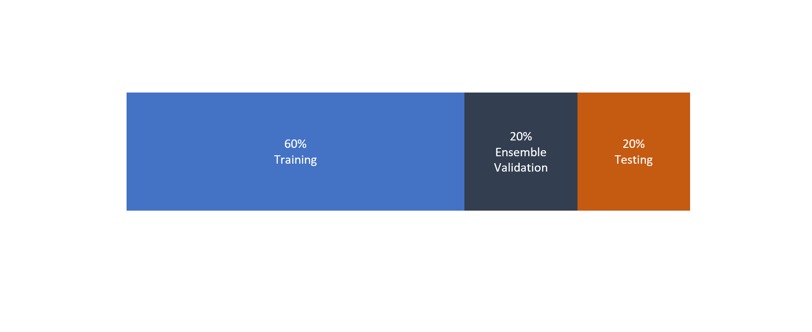

```{r setup, include=FALSE}
knitr::opts_chunk$set(echo = TRUE)
```

```{r load-deps, message=FALSE, warning=FALSE}
#load dependencies
require(plyr)
require(dplyr)
require(osmdata)
require(Hmisc)
require(usedist)
require(leaflet)
require(sf)
require(geosphere)
require(doParallel)
require(foreach)
require(plotly)
require(knitr)
```

## Synopsis

## Data

### Features

The data have been downloaded from the online property website domain.com.au by
a member of the online data science community kaggle.com, you can see the post 
[here](https://www.kaggle.com/anthonypino/melbourne-housing-market). Thank you
to user anthonypino.

```{r show-data, results='asis'}
#----read in data
property_data <- read.csv('original_data/Melbourne_housing_FULL.csv')

#----rename columns
names(property_data) <- c('suburb','add','nrooms','type','price','method','agent','date',
              'precomputeddist','pc','nbedroom','nbathroom','ncar','land_area',
              'building_area','year_built','council_area','lat','lng','region',
              'propcount')

#----recast types
property_data$date = as.Date(property_data$date,format='%d/%m/%Y')
property_data$suburb = property_data$suburb %>% 
    as.character %>% capitalize %>% as.factor
property_data$add = as.character(property_data$add)
property_data$propcount = as.numeric(property_data$propcount)
property_data$precomputeddist = as.numeric(property_data$precomputeddist)

#----compute distance from city
MELBOURNE_CENTRE = c(144.9631,-37.8136)
locs = select(property_data,c(lng,lat))
property_data$dist_cbd = apply(locs,1,function(loc){distm(loc,MELBOURNE_CENTRE)})

#give every object an ID
property_data$ID = as.character(1:nrow(property_data))
```

After parsing and an `ID` column is appended to the data, the table has 
`r nrow(property_data)` records of sales, each with `r ncol(property_data)` 
features. View the first 100 rows of the data [here](show_data.html).

**discuss the data in its default form**

write here
[download the data yourself here](https://www.propertyandlandtitles.vic.gov.au/__data/assets/excel_doc/0015/54213/suburb_house_2017.xls)
```{r median-comparison, echo=FALSE, message=FALSE, warning=FALSE}
#parse government data
gov_median_data <- read.csv('other_data/suburb_house_2017_edited.csv',stringsAsFactors = F)
names(gov_median_data)[1] <- 'suburb'
gov_median_data$suburb <- gov_median_data$suburb %>% tolower %>% capitalize

#limit property_data to 2017
property_data_2017 <- subset(property_data,date<'2018-01-01' & date > '2016-12-31')
#limit to houses
property_data_2017 = property_data_2017[property_data_2017$type=='h',]


#select relevant columns
gov_median_data =  gov_median_data %>% select(c(suburb,X2017))
#rename column
names(gov_median_data)[2] <- 'median_price'
property_data_2017 <- group_by(property_data_2017,suburb) %>% 
    summarise(median_price = median(price,na.rm=T),count=n())

#record how many properties were sold in this area, compared to total
property_data_2017$prop <- property_data_2017$count/sum(property_data_2017$count)

comparison_data = merge(property_data_2017,gov_median_data,by='suburb',suffixes = c('_pd','_gov'))


plot_ly(data=comparison_data,
        x=~median_price_gov,
        y=~median_price_pd,
        type='scatter',
        mode='markers',
        text=paste0(comparison_data$suburb,'\n',comparison_data$count,' sales'),
        hoverinfo='text'
) %>% add_lines(x=c(0,4e+6),y=c(0,4e+6),inherit = F) %>%
    layout(showlegend=F,
           xaxis=list('title'='Median Sale Price in our Dataset'),
           yaxis=list('title'='Median'))


```

## Objectives


## Data Preparation
**skip alot of this, or collapse** not bold

### Cleaning


### Validation
The validation scheme is as follows:

This scheme has two main benefits over other popular methods:

* **It is fair.** explain this

* **It used all of the training/ensemble validation data for the final model.**
explain this




### Reconstruction
```{r na_proportion , results='asis' }
na_prop = sapply(property_data,function(x){mean(is.na(x))})
na_prop_df = data.frame('feature'=names(na_prop),'prop_na'=na_prop)
na_prop_df = na_prop_df[na_prop_df$prop_na>0,]
na_prop_df = na_prop_df[order(na_prop_df$prop_na,decreasing = T),]
na_prop_df$prop_na = round(na_prop_df$prop_na,2)

#write a 
na_prop_df  %>% kable(row.names=F,
                      col.names = c('Feature','Proportion of Objects with NA Values'))

```


**note recon after validation**

include some plots with the red coloring

dont harp on


## EDA
** skip alot of this, or collapse**

## Baseline Model

## Importing data from OSM

## Primary Models

### K-Nearest Neighbours

### XGBoost

### Linear methods

## Ensembling

## Discussion

## Conclusion

## Further Analysis