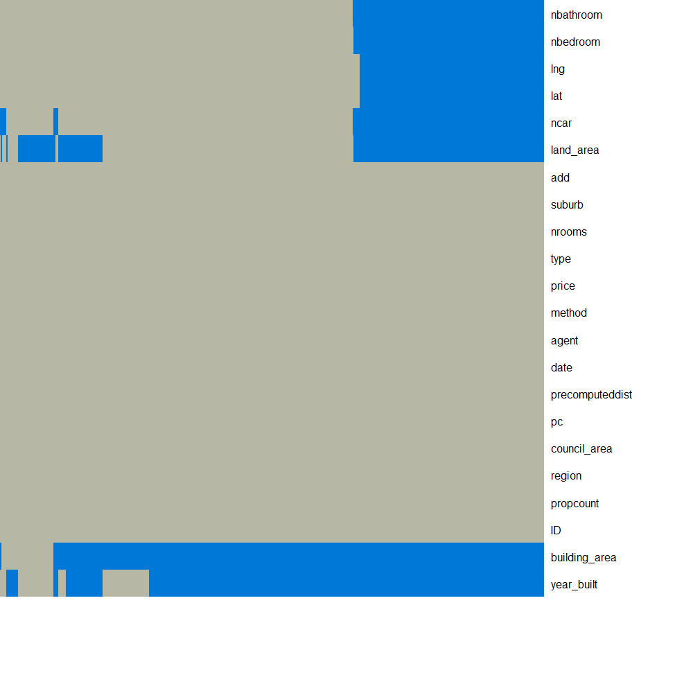

```{r}
#See the code by hitting the <div style="height:1px;">button </div>
```

The R code


**1. Primary modelling**<br>
    The primary models will be trained on an initial `train0` set using cross 
    validation. After this each model produces out-of-fold predictions on the 
    `train0` set by training on all but one fold, and predicting on that fold. Then
    the models are retrained on all of `train0` and predict on the 
    `ensemble_validation` set.

**2. Ensembling**
    The ensembling meta-model is trained on the predictions of the primary
    models on `train0`, and potentially a few select features from the data. The
    meta-model is then validated on the `ensemble_validation` set.

The `R` code

**1. title**
    test1

**2. another**
    test2

more text



```{r cleaning-1 , include=TRUE, message=FALSE, warning=FALSE , fig.width=10 , fig.height=10}
require(png)
#--This task was too computationally expensive to run inside a markdown doc-----
fig <- readPNG('na_heatmap.png')
plot.new()
rasterImage(fig,0,0,1,1)
```