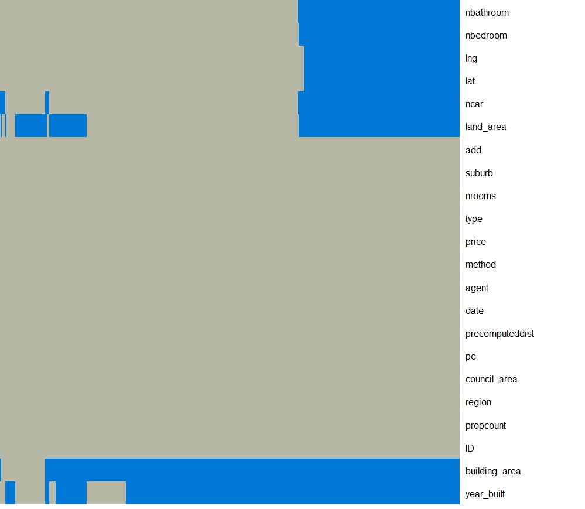

```{r setup, include=FALSE}
knitr::opts_chunk$set(echo = TRUE)
```


```{r}
require(png)
```

```{r na-heatmap , include=TRUE, message=FALSE, warning=FALSE , fig.width=10 , fig.height=10}
#--This task was too computationally expensive to run inside a markdown doc-----
fig <- readPNG('na_heatmap.png')
plot.new()
rasterImage(fig,0,0,1,1)
```

<center>
<br>
{
width=80%}
</center>

*<br>caption of image NA `NA`*


<center>
{
width=80%}
</center>

*caption of image*

